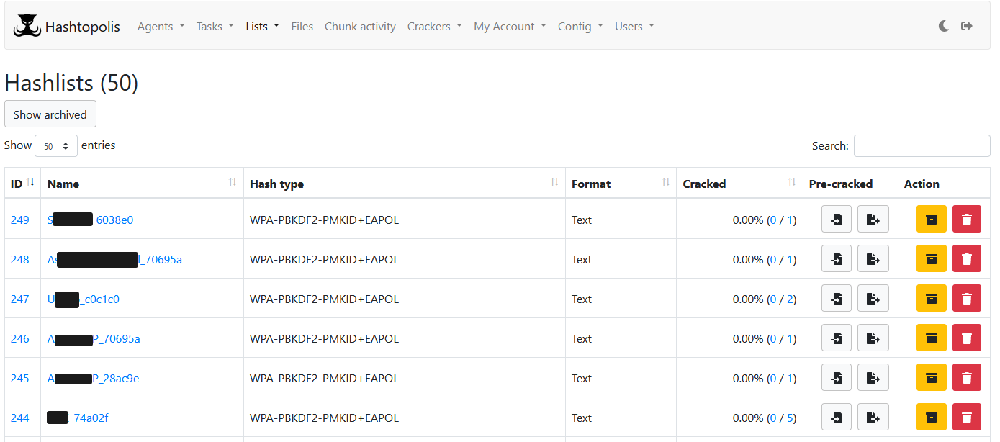
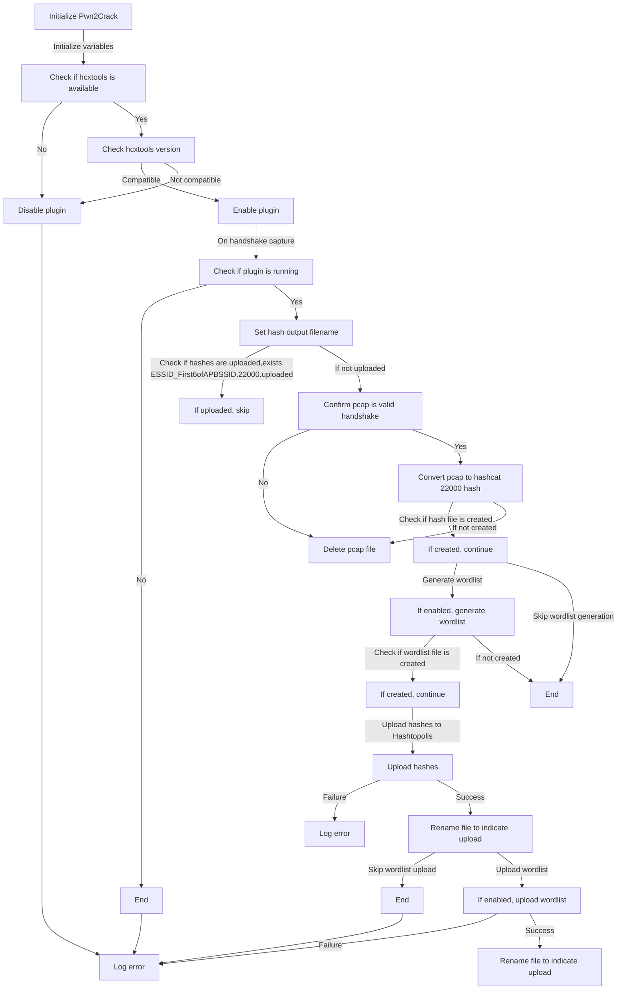

# Pwnagotchi-To-Hashtopolis-Plugin

Pwn2Crack is a Pwnagotchi plugin that processes captured handshakes (PCAP files). It converts them into Hashcat-compatible 22000(WPA-PBKDF2-PMKID+EAPOL) hashes for immediate cracking. When online, it automatically uploads the hashes and creates a new 'hashlist' on your Hashtopolis server. You can think of Pwn2Crack as an upgraded version of the Pwnagotchi 'Hashie' plugin, with seamless loot dispatch to your password-cracking server.

## Features

- Test captured handshakes and confirm they are complete and useable WiFi password hashes.
 To add some context, my recent default Pwnagotchi build, with no plugins enabled, had 270 handshakes captured. After testing the PCAPs, only 93 had the useable password hashes. Now, with Pwn2Crack you can be sure when you catch a handshake that it is good.

 - Updated Hashcat mode 22000 support; modes 2500 & 16800 are deprecated.

 - Generate a wordlist from PCAPs by pulling ESSID.
    The wordlist will help you create a target-specific worklist for cracking. Think of how many times you have found the WiFi name is the company name, and the password was also something related to the company name.

- Automate adding WiFi hashes to Hashtopolis Server for cracking.

## Overview
Pwn2Crack aims to streamline a Red Teamer or PenTester process from capturing the WiFi hash to cracking passwords. When the Pwnagotchi captures a handshake, Pwn2Crack will test the PCAP file for a complete and usable WiFi hash. If the PCAP file is found to be **unusable, it will be deleted**. If the PCAP file is good, a file(```<ESSID>_<First6ofAPBSSID>.22000```) with the hashes will be created. Optionally, a wordlist(```<ESSID>_<First6ofAPBSSID>.wordlist```) file will be created. Whenever the Pwnagotchi gets a connection to the internet, triggered by the "on_internet_available()" function, it will connect to your Hashtopolis server and upload the hash file and wordlist files.



### "on_internet_available()" function
The Pwnagotchi's plugin API has the "on_internet_available()" function. This is triggered when the system can open a connection to "pwnagotchi.ai:443". So, the "on_internet_available()" will only trigger if you have a fully working DNS and Internet connection.

### Hashcat Mode 22000 Update
Since the release of the Pwnagotchi, there have been updates to the WiFi hash cracking process. Hashcat has deprecated hash modes 2500(EAPOL, AKA:4-way handshakes) and 16800(PMKID) since version 6.0. The new replacement mode, mode 22000, combines these two hash-capturing methods into one process.

#### Old Method
 1. Pwnagotchi capture PCAP containing EAPOL or PMKID traffic.
 2. Use hcxpcaptool to extract a EAPOL handshake hash to a Hash.2500 file.
 3. Use hcxpcaptool to extract a PMKID hash to a Hash.16800 file.
 4. Set up a Hashcat cracking process for the Hash.2500 file.
 5. Set up a Hashcat cracking process for the Hash.16800 file.

#### New Method
 1. Pwnagotchi capture PCAP containing EAPOL or PMKID traffic.
 2. Use hcxpcap**ng**tool to extract both the EAPOL handshake AND PMKID hash to a Hash.22000 file.
 3. Set up a Hashcat cracking process for the Hash.22000 file.

# Install
You will need to download and compile ZerBea's version of hcxtools-v6.2.7. The **old hcxtool**, like the one Hashie uses,  will not work.

GitHub Repo: https://github.com/ZerBea/hcxtools

Required Version Release: https://github.com/ZerBea/hcxtools/releases/tag/6.2.7

**Q:** Why is Pwn2Crack not using the latest version of ZerBea's hcxtools???

**A:** In short, hcxtools version 6.2.8 and up require OpenSSL 3.0 EVP API. Most of the community is still using EvilSocket's Pwnagothchi v1.5.5, built on a now outdated OS. The Pwnagothchi v1.5.5 OS(Kali for Pi0) cannot support OpenSSL 3.0. However, for those who have managed to get a new OS working on a Pi02, the latest versions of hcxtools should work with this plugin(maybe? have not tested).

### Prerequisite
If you are on a totally fresh install of Pwnagotchi v1.5.5, you will need to run "apt update" multiple(3-4) times while accepting all changes to updating the repository list.

    apt update
    apt install -y python3-requests build-essential pkg-config libcurl4-openssl-dev libssl-dev zlib1g-dev make gcc

### HcxTools Install

    wget https://github.com/ZerBea/hcxtools/archive/refs/tags/6.2.7.tar.gz
    tar xzvf 6.2.7.tar.gz
    cd ./hcxtools-6.2.7

    # Build the source code.
    make
    # Install the executables to `/usr/bin`
    make install

    # Confirm the install was successful by running the following command
    /usr/bin/hcxpcapngtool -v

### Installing Pwn2Crack
After installing the hcxtools package, adding Pwn2Crack is simple. Copy the "pwn2crack.py" file to your existing Pwnagotchi's plugins folder. Then copy the text of the "config.toml" file to your Pwnagotchi's "/etc/pwnagotchi/config.toml" file. You will need to alter the setting to match your setup. The configuration options are labeled if they are required or optional. I also added notes about how the options can affect your cracking process.

**! Happy Hunting !**

# Data Flow Chat


#
